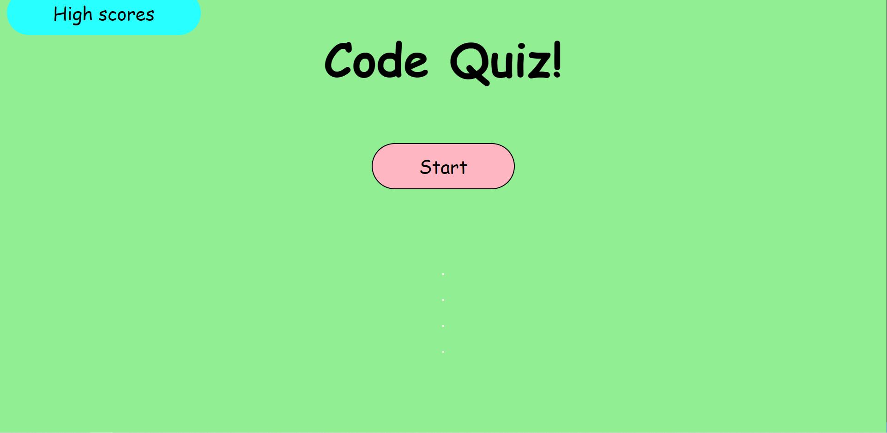

# code-quiz

## Description

https://patameglio.github.io/code-quiz/

This web application is a quiz that begin when you click Start. It will prompt a questions with 4 choices to choose from. 
Some tings to note about this project.
- a timer of 60 seconds will start when you begin the quiz
- the timer will go down 10 seconds for every wrong answer
- user high score will save at the end with their initials
- you can visit the high scores page to see all previous high scores

Javascript has been the toughest subject, but with Jqueries, I have foudn that this project could have been made easier. 